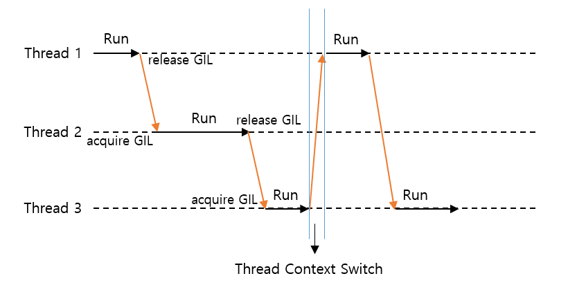

# Python GIL과 멀티 스레딩

## GIL(Global Interpreter Lock)이란?

Python의 기본 구현체인 CPython에서는 GIL(Global Interpreter Lock)로 인해 멀티 스레딩 프로그램에서 하나의 스레드만 수행할 수 있도록 한다.

> In CPython, the global interpreter lock, or GIL, is a mutex that protects access to Python objects, preventing
> multiple threads from executing Python bytecodes at once. The GIL prevents race conditions and ensures thread safety.
> [참조](https://wiki.python.org/moin/GlobalInterpreterLock)

GIL(global interpreter lock)은 동시에 Python 바이트 코드를 실행하지 못하도록 Python 개체에 대한 액세스를 보호하는 잠금 장치(mutex)다.
GIL은 race condition을 방지하고 thread-safety를 보장한다.

### race condition

Python 스레드는 동일한 메모리를 공유하게 되는데 프로그램이 실행될 때 둘 이상의 스레드가 동시에 접근하는 상황을 말한다.

아래와 같이 thread_one과 thread_two라는 두 개의 스레드가 있다.

- thread_one:a = a + 2
- thread_two:a = a * 3

thread_one이 먼저 액세스하고 thread_two가 두 번째로 액세스할 수 있는 경우 결과는 다음과 같다.

- a = 2 + 2, a 이제 4입니다.
- a = 4 * 3, a 이제 12입니다.

그러나 thread_two가 먼저 실행된 다음 thread_one이 실행되는 경우 다른 출력이 표시된다.

- a = 2 * 3, a 이제 6
- a = 6 + 2, a 이제 8

위와 같은 상황을 통해 실행 순서가 중요한 것을 알 수 있다. 하지만 두 스레드가 동시에 변수를 읽고 작업을 수행한다면 결과를 누가 먼저 쓰느냐에 따라 a는 결국 4 또는 6이 된다.
이것이 race condition이라 할 수 있다. 즉, 시스템의 동작이 제어할 수 없는 다른 이벤트의 순서나 타이밍에 따라 달라지는 시스템 상태이다.

### thread safety

이미 언급했듯이 Python 스레드는 동일한 메모리를 공유한다. 여러 스레드가 동시에 실행되는 경우 스레드가 공유 데이터에 액세스하는 순서를 알 수 없다. 이를 위해 CPython에서는 GIL을 적용했다.
그렇지 않으면 메모리 누수(memory leak)나, 그 객체에 대한 참조가 여전히 존재하는 동안 메모리를 잘못 해제해 Python 프로그램에서 충돌이나 알 수 없는 버그가 발생할 수 있다.

## Python의 멀티 스레딩

GIL로 인해 Python의 멀티 스레딩은 의미가 있어보이지 않는다. 하지만 예외적인 상황이 있다. I/O를 수행하는 경우에는 GIL이 항상 해제되어 있다는 것이다.

예제를 통해 스레드를 생성하고 실행해보자.

**loop_threads.py**를 먼저 실행해보면 결과는 다음과 같다:

```shell
$ python3 loop_threads.py 
[Single Thread] total time : 2.969977855682373
[Multi Thread] total time : 3.083374261856079
```

위에서 소개한 바와 같이 멀티 스레딩의 효과를 보지 못하고 있는 것을 확인할 수 있다.

하지만, I/O의 지연인 경우에는 다르다는 것을 아래의 예제를 통해 확인해 볼 수 있다.

**sleep_threads.py**를 실행해보자:

```shell
$ python3 sleep_threads.py
[Single Thread] total time : 4.004619121551514
[Multi Thread] total time : 2.000965118408203
```

CPU-bound 작업이 아니라 I/O 바운드 작업이라면 요청을 걸어두고 대기하면 되기 때문에 멀티 쓰레드로 구현했을 때 성능을 개선시킬 수 있다.

아래 그림처럼 thread의 스윗치 과정에서 시간이 오래 걸리는 문제가 발생하기도 한다.



## 결론

참고로 CPython의 특성이지 모든 Python 구현체에서 갖고 있는 특징은 아니라고 한다.
지금까지 싱글 스레드 작업을 해왔던 나에겐 다른 세상을 보는 기분으로 자료를 찾아보는 시간이었던 것 같다.
멀티 스레드를 사용하게 된다는 건 좀 더 신경써야 할 부분이 많아지기 때문에 지금까지처럼 싱글 스레드로 구현하는게 좋을 수도 있겠다 싶으면서도 이전에 데이터의 입출력 처리로 애먹었던 경험을 생각하면 적재 적소에 잘
적용할 수 있으면 좋겠다 싶은 생각이 든다.

## [참고]

- https://docs.python.org/3/library/threading.html?highlight=threading
- https://docs.python.org/3/glossary.html#term-global-interpreter-lock
- https://python.land/python-concurrency/the-python-gil
- https://realpython.com/python-gil/
- https://8iggy.tistory.com/241